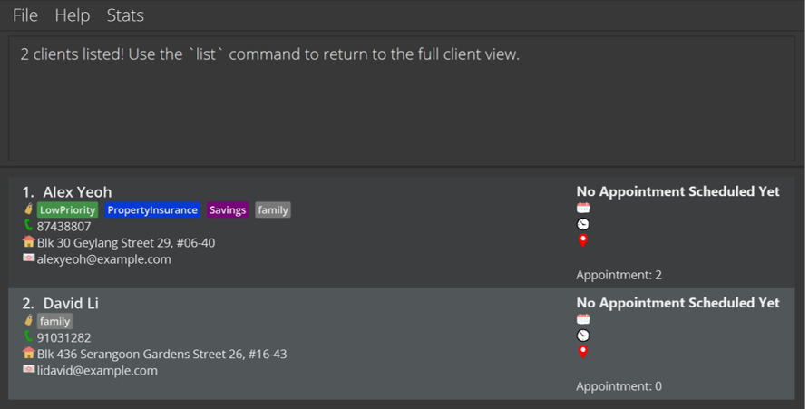
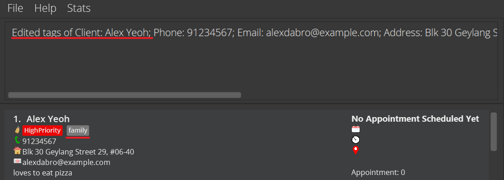
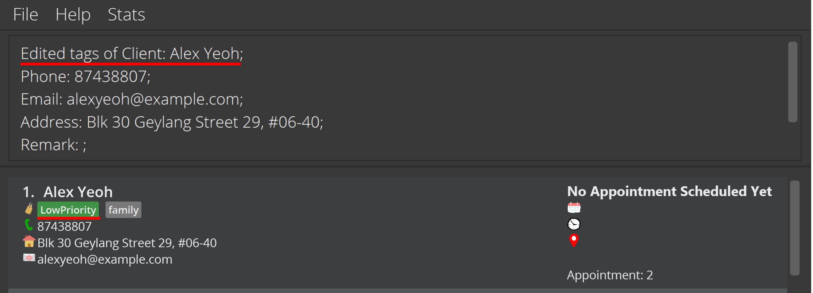
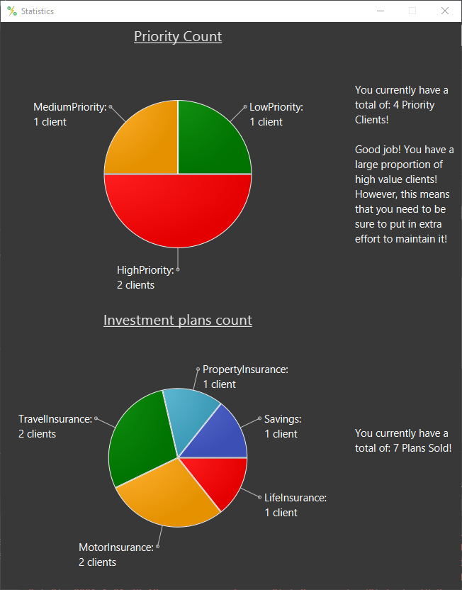

* Table of Contents
{:toc}

--------------------------------------------------------------------------------------------------------------------

## Introduction

  

Welcome and thank you for downloading **FAST**! Are you a financial advisor having troubles managing your contacts
on your phone? Do you find existing contact management software troublesome and not intuitive to use? Do you want 
a cheaper alternative compared to those paid contact management software? If you answered YES! to all those questions
then FAST is right for you!

FAST is an acronym for Financial Advisor Smart Tracker (FAST), the meaning behind it is that we aim to be fast and 
efficient when it comes to managing your contacts.
Financial Advisor Smart Tracker (FAST) is a **free open-source desktop app for Financial Advisors to manage 
their contacts.** 
More importantly, FAST is **optimized for those who prefer to work with a Command Line 
Interface** (CLI) while still having the benefits of a Graphical User Interface (GUI). 
For Financial Advisors that can type fast, FAST will get your contact management tasks done faster than traditional GUI apps!

### Structure of this document
To help you make the most of your time, we have added a multitude of features to FAST, which will help you efficiently manage your contacts.
As such, this user guide has been structured to help you find what you are looking for.

In [How to use this user guide](#how-to-use-this-user-guide), you can learn how to most effectively read through this guide.

In [Features overview](#features-overview), you will find all the features available in FAST.

In [Quick start](#quick-start), you will find simple instructions on how to quickly begin using FAST.

In [Features](#features), you can find documentation on how to use the features available in FAST.

In [FAQs](#faqs), you may find answers to questions or problems you might have while using FAST.

In [Command summary](#command-summary), you will find a summary of the commands available in FAST.

### How to use this user guide
We recommend first time users to read the user guide in the order that is written.
Throughout the user guide, we include links which will jump to the corresponding section of the user guide. These
links allow you to quickly navigate this document.

Multiple special formats are used to highlight information that will be important or useful to you.
These include:

**Cautions**

:exclamation: **Caution** Example caution

Messages that appear in these boxes are important to take note of, as not knowing them might harm your user experience.

**Tips**

:bulb: **Tip:**
Example tip

Messages that appear in these boxes can help you to more effectively use FAST.

**Useful information**

:information_source: Example useful information

Messages that appear in these boxes will be useful in helping you to understand how to use FAST.

**Technical Information**

`Example technical information`

Messages that appear in these boxes indicate that the message is of a more technical nature, such as user input.

### Features overview
Here is an overview of the features FAST offers:
* Keep track of your client's information (i.e. Name, Phone number, Email address, Home address, and Remarks) in our
  all-in-one app!
* Record and keep track of your client's appointment dates. Never miss another appointment date again!
* Tag your clients with the insurance plan they have purchased or are interested in.
* View built-in analysis of your client base to better understand your portfolio.

Interested? Jump to [Quick Start](#quick-start) to get started! 

## Quick start

1. Ensure you have Java `11` or above installed in your Computer. FAST can be used 
on any operating system including Windows, macOS or Linux

1. Download the latest `fast.jar` from [here](https://github.com/AY2122S1-CS2103T-T09-4/tp/releases).

1. Copy the file to the folder you want to use as the _home folder_ for your FAST.

1. Double-click the file to start the app. The GUI similar to the below should appear in a few seconds. 
   When you first start up, FAST will contain some sample data for you to explore the different features.
   
   
   

   :information_source: More icons will be added in future iterations 
   

1. You are now ready to start managing your clients!
   
### User interface
Referring to the image above, the _Menu bar_ at the top is where you can access the _Help page_, _Stats page_ and exit 
FAST.   
Next, the _Results display_ is where FAST gives you feedback to your commands. For example, if you make a typo
in your command, FAST will inform you here!   
Following that, we have the _Client information_ cards. Each client is represented by a card, which contains
all the information of that client.   
Lastly, the _Command box_ is where you can type in all your commands!

### Try it out!

We recommend that you play around with FAST to get a better idea of the features and their usages. Don't worry, these
are all sample data! Here are some commands you can try to see what they do:

    
1. Add a contact named "John Doe" to FAST
   * `add n/John Doe`
    
2. Delete the 3rd contact in FAST
    * `delete 3`
    
3. View all your saved contacts
    *  **`list`**
    
4. Try searching for a high priority client!
    * `find pr/high`
    
5. Try setting an appointment for him.
    * `appt 1 d/2021-12-12 t/14:30 v/Buona Vista`
    

:information_source: When you are ready to use FAST to keep track of your own clients, you can use 
`clear` to delete this sample data.  

 Refer to the [Features](#features) below for details of each command.

--------------------------------------------------------------------------------------------------------------------

## Features

**:information_source: Notes about the command format:** 

Take note that for all the commands listed below, we follow these notations and style!

* Words in `UPPER_CASE` are the parameters to be added in by the user. 
  * e.g. for `add n/NAME`, `NAME` is where you would replace it with the actual client's name such as `add n/John Doe`.

* Items in square brackets are optional. 
  * e.g. `n/NAME [t/TAG]` can be used as `n/John Doe t/friend` or as `n/John Doe`.

* Items with `…`​ after them can be used zero or more times. 
  * e.g. `[t/TAG]…​` can be `t/friend`, `t/friend t/family` or just left empty.

* Parameters can be in any order. 
  * e.g. if the command uses this format: `n/NAME p/PHONE_NUMBER`, `p/PHONE_NUMBER n/NAME` is also acceptable.

* If a parameter is expected only once in the command, but you specified it multiple times, only the
  last occurrence of the parameter will be taken. 
  * e.g. if you specify `p/12341234 p/56785678`, only `p/56785678` will be taken.

* For commands that do not take in any parameter (such as  `list`, `exit` and `clear`), anything written after
  the command will be ignored. 
  * e.g. `help 123` will simply be interpreted as `help`.

* `INDEX` refers to the index number shown in the client list. The index **must be a positive integer** 1, 2, 3, …​

### Viewing help: `help`

You can use the `help` command to open a new window that contains the command usage, and a quick start guide.
In the help window, you can access all the command usages using the dropdown menu.

**Format**: `help [COMMAND]`

**Examples**:
* `help` will just open the default help window
* `help add` will open the help window and directly navigate to the `Add` command help page.

:bulb: **Tip:**
The help window can also be quickly accessed by entering using the F1 key on your keyboard!

### Adding a client: `add`

You can add a client to FAST.

**Format**: `add n/NAME p/PHONE_NUMBER e/EMAIL a/ADDRESS [t/TAG]…​`

:bulb: **Tip:**
A client can have any number of tags (including 0)

**Examples**:
* `add n/John Doe p/98765432 e/johnd@example.com a/John street, block 123, #01-01` will add a new client called 
  `John Doe`, who has phone number of `98765432`, has an email address `johnd@example.com` and stays at 
  `John street, block 123, #01-01`.
* `add n/Betsy Crowe t/friend e/betsycrowe@example.com a/Newgate Prison p/1234567 t/criminal` will add a new client 
   called `Betsy Crowe`, has a phone number of `1234567`, has an email address `betsycrowe@example.com`, 
  stays at `Newgate Prison` and is tagged as both a `friend` and `criminal`.

### Listing all clients: `list`

Shows you the list of all your clients in FAST. 
This command is useful to return to viewing your full client list after a 
[find](#searching-for-clients-find) command has been executed.

**Format**: `list` 

### Editing a client: `edit`

You can edit an existing client in FAST. 
This can be used if the client's information has changed, or if you entered an incorrect entry previously.

**Format**: `edit INDEX [n/NAME] [p/PHONE] [e/EMAIL] [a/ADDRESS] [t/TAG]…​`

* Edits the client at the specified `INDEX`. The index refers to the index number shown in the displayed client list.
* At least one of the optional fields must be provided.
* Only the edited fields will be updated to the input values, while the unedited values are unchanged.
* When editing tags, all existing tags of the client will be replaced with the new tags.
* You can remove all the client’s tags by typing `t/` without specifying any tags after it.
* For further information on the type of tags available and how to use them, refer to the [Tags](#tags) section.

**Examples**:
*  `edit 1 p/91234567 e/johndoe@example.com` Edits the phone number and email address of the first client to be `91234567` and `johndoe@example.com` respectively.
*  `edit 2 n/Betsy Crower t/` Edits the name of the second client to be `Betsy Crower` and clears all existing tags.

### Searching for clients: `find`

Finds clients by their name, [priority](#tags), [tags](#tags) or 
[remarks](#adding-a-remark-rmk). This is useful if your have many clients in FAST and wish to quickly find a
specific client. To return to the full client list, you can use the [list](#listing-all-clients-list) command

**Format**: `find QUERY [MORE_QUERIES]` OR `find pr/PRIORITY [MORE_PRIORITIES]`
OR `find t/TAG [MORE TAGS]` OR `find r/REMARK [MORE REMARKS]`

* The search is case-insensitive. e.g. `hans` will match `Hans`
* The order of the queries does not matter. e.g. `Hans Bo` will match `Bo Hans`
* You can search by name, priority, tags or remarks using the formats shown above.
* Names with words starting with the query will match. e.g. `Han` will match `Solo Hans`.
* For priority searches, there are 3 priorities, `pr/low`, `pr/med`, or `pr/high`.
* Any remarks containing the searched remark will match. e.g. `r/piz` will match `likes pizza`.
* Clients matching at least one search query will be returned (i.e. `OR` search).
  e.g. `Hans Bo` will return `Hans Gruber`, `Bo Yang`

**Examples**:
* `find John` returns `john` and `John Doe`
* `find alex david` returns `Alex Yeoh`, `David Li` 
  
* `find pr/high med` returns all clients with `HighPriority` and `MediumPriority`.
* `find t/friends enemies` returns all clients tagged with `friends` or `enemies`.
* `find r/good` returns all clients with remarks containing `good`.

:bulb: **Tip:**
When searching for remarks, use more specific queries for better results.

### Deleting a client: `del`

You can delete the specified client from FAST. This is useful when a client has stopped using your services.

**Format**: `del INDEX`

* Deletes the client at the specified `INDEX`.
* The index refers to the index number shown in the displayed client list.

**Examples**:
* `list` followed by `del 2` deletes the second clients in FAST.
* `find Betsy` followed by `del 1` deletes the first client in the results of the `find` command.

:bulb: Tip:
Can be used to delete up to **10** contacts in a single `del` command by supplying more `INDEX`.

**Format** 1: `del INDEX INDEX [INDEX]...`
**Format** 2: `del INDEX-INDEX`

:exclamation: Reminder:
If *Format 1* is used, there should be a space in between each `INDEX`.
If *Format 2* is used, first `INDEX` should not be larger than second `INDEX`. There *should not* be any spaces in between '`INDEX`-`INDEX`'. 

**Examples**:
* `del 2 4 6 8 10` deletes the 2nd, 4th, 6th, 8th and 10th person in FAST.
* `del 3-5` deletes the 3rd, 4th and 5th person in FAST.

:exclamation: **Caution:**
This CANNOT be undone!

### Adding a remark: `rmk`

You can add a remark to an existing client in FAST. This is useful for adding additional client information such 
as their preferred meeting timing, allowing you to better keep track of your clients' preferences and habits.

**Format**: `rmk INDEX [r/REMARK]`

* Adds a remark to the client at the specified `INDEX`.
* Remarks have a character limit of 100 characters.
* To delete a remark, leave the remark parameter `[r/REMARK]` empty.
   

   :information_source: Remarks should be used to annotate contacts with longer and more specific things compared to tags,
   which should mostly be one or two words. 
   

**Examples**:
* `rmk 1 r/loves to eat`  adds a remark `loves to eat` to the first client.

* `rmk 1` removes the remark from the first client. 

:bulb: **Tip:**
Try to add remarks with specific keywords so that it is easier to [search](#searching-for-clients-find) for them.

### Appointments

FAST is capable of storing and keeping track of appointments for your clients. You may save the date, time and venue of an appointment.
* `DATE` the date of the appointment should be inputted in the format **`yyyy-mm-dd`**.
* `TIME` the time of the appointment should be inputted in the 24-hour format **`HH:mm`**.
* `VENUE` the location of the appointment can at most be 30 characters long (including whitespaces).

#### Adding an appointment: `aa`

**Format**: `aa INDEX d/DATE [t/TIME] [v/VENUE]`

You can add a scheduled appointment with the client. An appointment includes a date, time and venue.
This allows you to keep track of all your clients' appointment dates all within the same app.
You can also [edit](#editing-an-appointment-ea),[delete](#deleting-an-appointment-da), 
or [mark as completed](#updating-completed-appointment-ma) an appointment.

* The `DATE` of the appointment must at least be specified.

**Examples**:
* `aa 1 d/2021-03-27` adds an appointment with date `27 Mar 2021` to the first client in FAST.

* `aa 3 d/2021-03-27 t/18:00` adds an appointment with date `27 Mar 2021` and time `1800hrs` to the third client in FAST.
* `find Matthew John` followed by `aa 3 d/2021-03-27 t/18:00 v/Velocity` adds an appointment with date `27 Mar 2021`, 
  time `1800hrs` and venue `Velocity` to the third client in the results of the `find` command.
   

   :information_source: This command will not work if the client has already been assigned an appointment. You will have to
   use the [edit appointment](#editing-an-appointment-ea) command. 
   

   
#### Editing an appointment: `ea`

You can edit a scheduled [appointment](#appointments) with the client. 
This command is useful when your appointment has been rescheduled or has a change in location.

**Format**: `ea INDEX [d/DATE] [t/TIME] [v/VENUE]`

* Edits a scheduled appointment with the client at the specified `INDEX` if the appointment exist.
* Existing details will be updated with the input data.
* At least **one** of the optional fields must be present.

**Examples**:
* `ea 1 d/2021-03-27` edits the appointment date to be `27 Mar 2021` of the first client.
* `ea 3 v/  t/18:00` edits the appointment time to be `1800hrs` and clears the appointment venue of the third client.

#### Deleting an appointment: `da`

You can delete a scheduled [appointment](#appointments) with the client. 
This command should be used when the appointment has been cancelled with a client.

**Format**: `da INDEX`

* Deletes a scheduled appointment with the client at the specified `INDEX` if the appointment exist.
* Existing details will be deleted.

**Examples**:
* `da 1` deletes the appointment of the first client.
* `find Ben` followed by `da 3` deletes the appointment the third client in the result of the `find` command.

#### Updating completed appointment: `ma`

You can mark the appointment [appointment](#adding-an-appointment-aa) with the client as completed.
This also allows you to keep track of the number of completed appointments with your client.

**Format**: `ma INDEX`
* Increment the completed appointment count with the client at the specified `INDEX` if the appointment exist.
* Existing details will be deleted.

**Examples**:

* `ma 1` updates the completed appointment counter of the first client.

* `find Matthew` followed by `ma 3` updates the completed appointment counter of the third client in the result of 
  the `find` command.

### Sorting all clients: `sort`

You can sort all existing client by the given condition. 
Currently, you can sort by name, [appointment date](#appointments), and [priority tag](#tags). 
This allows you to keep your clients list orderly and well-organised.
It can also be used to quickly sieve through large client lists.

**Format**: `sort KEYWORD`
* There are only 3 values for `KEYWORD`: `name`, `appointment`, `priority`.
* `name` will sort all clients in alphabetical order from A to Z.
* `appointment` will sort all client by appointment date from the earliest date to latest.
* `priority` will sort all client by priority tag from the highest to the lowest priority.

**Example**:
* `sort priority` Sorts all existing clients by their priority tag, from the highest priority to the lowest priority.

### Tags

Tags are a quick way for you to organise your contacts, and recall their key characteristics.
In FAST, we have three main types of tags:

1. Normal tags, which you can customise according to your needs.

:bulb: **Tip:**
Tags should be used to categorise clients; use short names for normal tags that you may be able to use for other clients as well!

2. Priority tags, which have fixed names and help you to remember which contacts you need to focus on first.

:bulb: **Tip:**
A client can **only have 1 priority tag** , but they can have other non-priority tags alongside the one priority tag.

3. Investment plan tags, which help you recall the plans that each contact has bought.

:bulb: **Tip:**
A client can have more than 1 investment plan tag, but they may not have more than 1 of the same investment plan tag.

For example, a client may have both Savings and Investment concurrently, but not 2 instances of Savings at the same time. 

#### Tag Naming Conventions

You can refer to the table below to quickly learn about how to use these three tags.

Tag type|Prefix|Term
--------|-------|-----
Normal|`No Prefix`| Your preferred tag name, that contains at most 20 alphanumeric characters and no spaces
Priority|`pr/`| `low`: Low Priority `med`:Medium Priority `high`:High Priority
Investment plan|`ip/`| `health`: Health Insurance `invest`: Investment `life`: Life Insurance `motor`: Motor Insurance `property`: Property Insurance  `save`: Savings  `travel`: Travel Insurance

In general, append the term to the prefix when referring to a priority or investment plan tag.
Normal tags do not have prefixes, so simply type in the desired tag name.

More examples of how to use these will be given in the following section.

#### Editing a tag: `tag`

You can modify the tags of a specified client. 

**Format**: `tag INDEX [a/TAG] [d/TAG]`
* Use `a/` to add a tag, and `d/` to delete a tag.
* Does not affect any unmentioned tags, unlike `edit`.
* Delete operations are performed first before add operations, regardless of their order in the input.
* Tags have a maximum length of 20 characters, and may only contain alphanumeric characters.

**Examples**: 
* `tag 1 a/family d/friend` will delete the `friend` tag before adding the `family` tag.

* `tag 1 d/pr/high a/pr/low` will delete the `HighPriority` tag before adding the `LowPriority` tag.

* `tag 1 a/ip/property` will add a `PropertyInsurance` tag to the contact.

### Viewing statistics

FAST comes with built-in statistics to provide you with an overview of your data.
To view the statistics, simply click the "Stats" menu item on the top bar or press `F2`.
Currently, FAST supports these statistics:
* Priority Tag Chart
* Insurance Plan Chart (Coming soon!)

### Clearing all entries: `clear`

You can clear all entries from FAST. This command is useful to remove the default sample data in FAST.

**Format**: `clear`

:exclamation: **Caution:**
This CANNOT be undone! 

### Exiting the program: `exit`

You can exit the program.

**Format**: `exit`

### Saving the data

FAST data is saved in the hard disk automatically after any command that changes the data.
There is no need to save manually.

### Editing the data file

FAST data is saved as a JSON file. 
It can be found at `[JAR file location]/data/fast.json`. 
If you are an advanced user, feel free to update your data directly, by editing that data file.

:exclamation: **Caution:**
**Be extremely careful when making any changes to the data file!** 
If any of your changes to the data file causes FAST to be unable to read the data file, 
FAST will start with an empty data file on the next run!

--------------------------------------------------------------------------------------------------------------------

## FAQs

**Q**: How do I transfer my data to another Computer? 
**A**: Install the app in the other computer and move your previous FAST `data` folder into the new FAST home folder. The `data` folder is shown below.  

**Q**: How do I save my data? 
**A**: You do not need to manually save any data, FAST automatically saves all your data for you when you exit the application. 
**Q**: I edited my data file, and now when I start FAST all my contacts are gone! What happened? 
**A**: It is likely that some of your changes to your data file caused FAST to be unable to read your data file. Double-check the changes you made, or revert them if necessary. If FAST is able to read the data file after you made the changes, all your saved contacts will appear on the next start.

--------------------------------------------------------------------------------------------------------------------

## Command summary

### Contact Management
Action | Format, Examples
--------|------------------
**Add Contact** | `add n/NAME p/PHONE_NUMBER e/EMAIL a/ADDRESS [t/TAG]…​`   e.g. `add n/James Ho p/22224444 e/jamesho@example.com a/123, Clementi Rd, 1234665 t/friend t/colleague`
**Delete Contact** | `del INDEX`  e.g. `del 3`
**Edit Contact** | `edit INDEX [n/NAME] [p/PHONE_NUMBER] [e/EMAIL] [a/ADDRESS] [t/TAG]…​`  e.g.`edit 2 n/James Lee e/jameslee@example.com`
**Add Remark** | `rmk INDEX [r/REMARK]`
**Edit Remark** | `rmk INDEX r/REMARK` OR `rmk INDEX`  e.g. `rmk 1 r/likes dogs`

### Appointment
Action | Format, Examples
--------|------------------
**Add appointment** |`aa INDEX d/DATE [t/TIME] [v/VENUE]`  e.g. `aa 3 d/2021-03-27 t/18:00 v/Clementi Park` 
**Delete Appointment** | `da INDEX`  e.g. `da 1` 
**Edit Appointment** | `ea INDEX [d/DATE] [t/TIME] [v/VENUE]`  e.g. `ea 3 v/Clementi Town d/2021-03-27 t/18:00` 
**Update Completed Appointment** | `ma INDEX`  e.g. `ma 5`

### Tags
Action | Format, Examples
--------|------------------
**Edit Tag** |`tag INDEX a/[TAG] d/[TAG]`   e.g. `tag 1 a/friend d/ip/life`
**Investment Plan Tag** | Health Insurance: `ip/health` Investment: `ip/invest` Life Insurance: `ip/life` Motor Insurance: `ip/motor` Property Insurance: `ip/property` Savings: `ip/save` Travel Insurance: `ip/travel`  
**Priority Tag** | Low Priority: `pr/low` Medium Priority: `pr/med` High Priority: `pr/high`

### Navigation
Action | Format, Examples
--------|------------------
**Find** | `find QUERY [MORE_QUERIES]` OR `find pr/PRIORITY [MORE_PRIORITIES]` OR `find t/TAG [MORE TAGS]` OR `find r/REMARK [MORE REMARKS]`  e.g. `find James Jake`
**Sort** | `sort KEYWORD`
**List** | `list`

### Others
Action | Format, Examples
--------|------------------
**Help** | `help [COMMAND]`   e.g. `help add`
**Clear** | `clear`
**Exit** | `exit`
